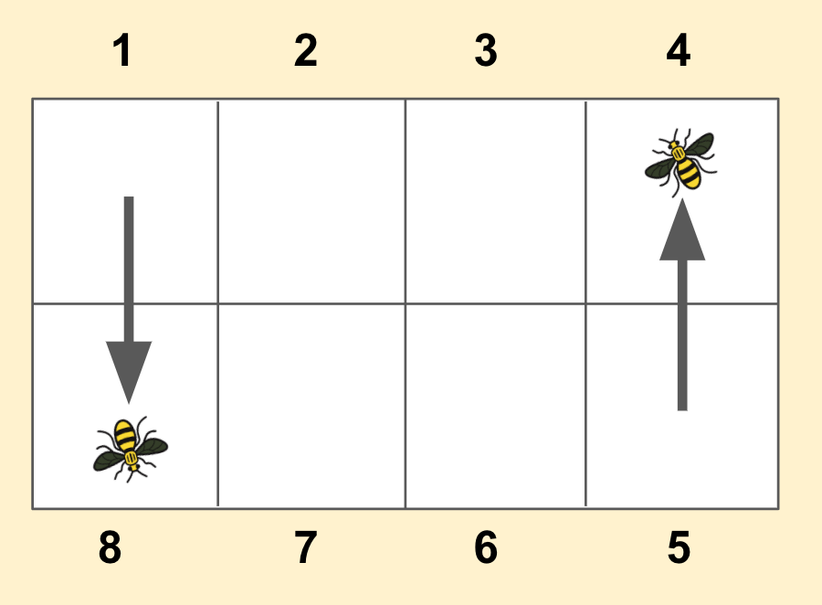

# Bumblebee
  An Interactive Bee-Hive Monitoring System to monitor the real-time activites of bees by analyzing real-time data from the 
  mutiple sensors mounted on bee-hive. 
  
   • Developed in C++ using Qt v5.11.1.
  
   • Database - SQLite3
  
The data included in the Github is produced via simulation using predictive mathematical models (bimodal distribution). (Real data is not included.)

### Sensor Board Illustration

  • A bee enters into the hive via Gate 1.
  
  • A bee exits out of the hive via Gate 5. 

  
  
  
  
  
